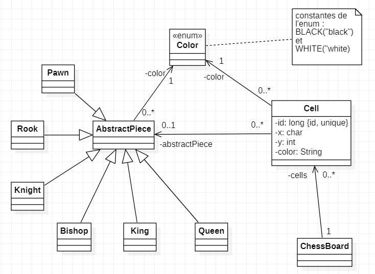
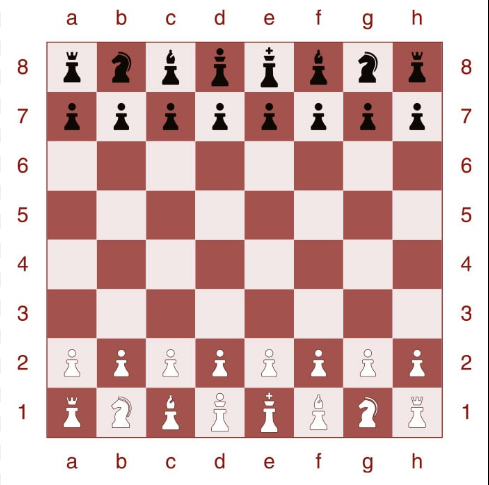

## Exos - 06/12/2023

### 1. Classes & Collection

 
#### 1.1 Modélisation du jeu d'échecs

Il manque la classe "ChessBoard" et des classes enfants d'AbstractPiece, vous devez les compléter et crééer la classe ChessBoard et son contenu.

(Simplement tout ce qui est attributs... et méthodes ?)
(Mettez à jour les classes déjà créée pour qu'elles utilisent l'Enum nouvellement créé)

#### 1.1 Création du jeu d'échecs

À la création de celle-ci, elle crééera les différentes cases du jeu d'échec (64), les coordonnées en x allant de "a" à "h" et en y allant de "8" à "1".

Il faudra aussi créer les pièces à leur bonne position ! Les blancs sont en bas et les noirs en haut.

Exemple de plateau final :

Ajouter les "toString" nécessaires pour tester et vérifier que tout s'est bien créé correctement.

Récap des images des pièces :

♜♞♝♛♚♝□♜
■♟♟♟♟♟♟□
♟■□■□■□■
■□■□■□■♟
□■□♙□■♞■
■□■♗♙□■□
♙♙♙■□♙♙♙
♖♘♗♕♔□♘♖

