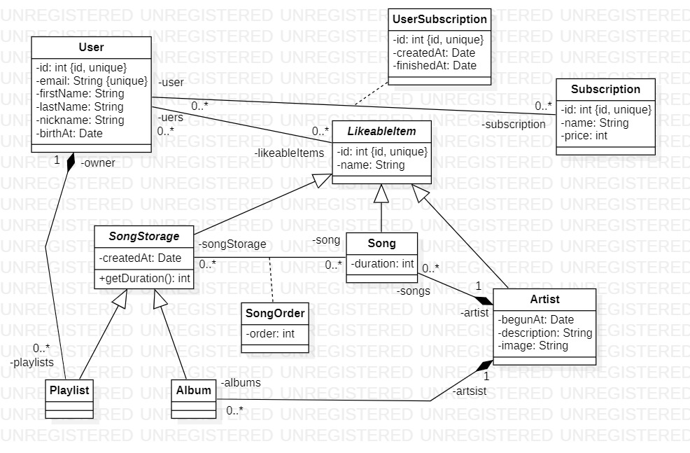

## Exos - 08/12/2023

### 1. Classes

 
#### 1.1 Créer les classes du Spotif-ish

#### 1.2 Réflexion intense

Faites les classes permettant de répondre à ce besoin (déterminez les attributs et éventuels méthodes de celles-ci)
- Je souhaite faire une application de recettes de cuisine
- Une recette va avoir différents ingrédients et chacun peut être en quantité différentes dans différentes recettes
- Une recette sera composé d'instructions indiquant comment la préparer
- Un utilisateur peut mettre des recettes en favori
- Un utilisateur peut générer une quantité de X repas, ces repas seront pris aléatoirement parmi des ingrédients similaires, afin d'éviter le gaspillage

- Rédiger les classes et leurs relations
- Simuler l'application de manière simpliste (Création des recettes + ingrédients + users)
- Et tester votre simulation de création de repas

