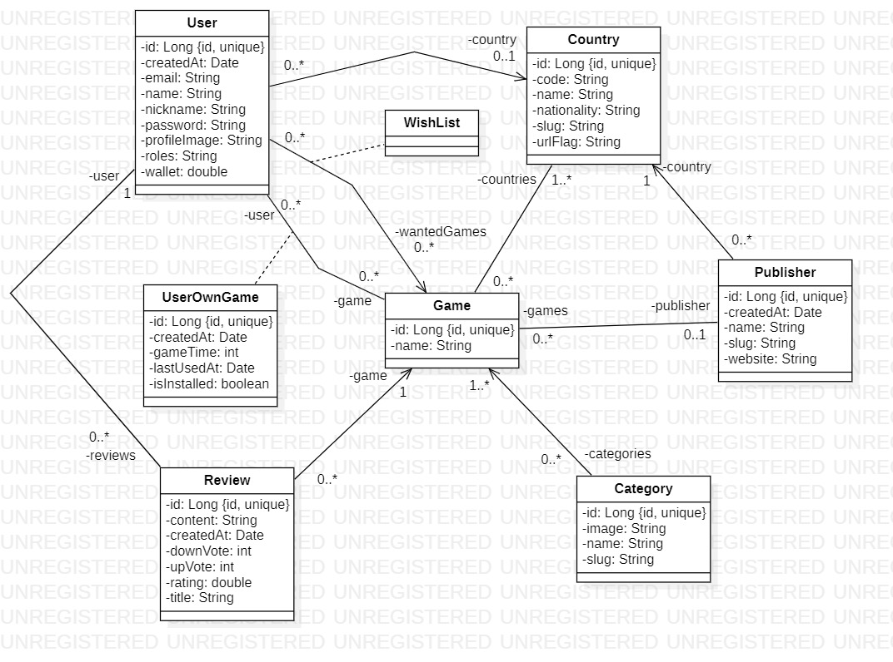

## Exos - 12/12/2023

### 1. Couche ORM (persistance) 

#### 1.1 Créer un **service** de nom "DBConnect"

- Cette classe sera un SINGLETON
- Elle ne devra renvoyer qu'une seule instance de la connexion à la base de donnée
- Tester votre classe (vérifier qu'il y a toujours la même instance de l'objet "Connection")
- Vous choisirez le connecteur de votre choix (MySQL ou MariaDB)

(PS : Cette classe doit donc utiliser un objet "Connection" en attribut)

#### 1.2 Créer les classes des entités métiers

- Créer les entités à partir du diagramme de classe

#### 1.3 Tester

Dans un premier temps on va faire une mauvaise pratique : tester dans le main un "SELECT * FROM country", histoire de voir si la connexion fonctionne et que l'on récupère bien les infos

### 2. Configurer les repository

Un "Repository" est une classe permettant d'intéragir avec la base de données, son but est d'effectuer des opérations simples en base de données pour un objet donné : on doit donc avoir un Repository par objet métier.

Dans un premier temps, on va créer un seul repository pour la classe "Country", de nom "CountryRepository".

#### 2.1 1ère étape

- Vous aurez besoin d'une méthode, qui à partir d'un "ResultSet" est capable de vous créer un objet de type "Country"

(PS : regarder le cours pour vous inspirer)

#### 2.2 2ème étape

On va configurer notre repository pour qu'il puisse :

- findAll() => "select * from Country"
- findOneById() => "select * from Country where Country.id = ?"
- save() => "insert into Country values (? , ?, ?)"
- remove() => "delete from Country where Country.id = ?"
- update() => "update Country set ? where Country.id = ?"

(PS : les objets Country doivent bien être créés... penser à paramétrer ça !)

