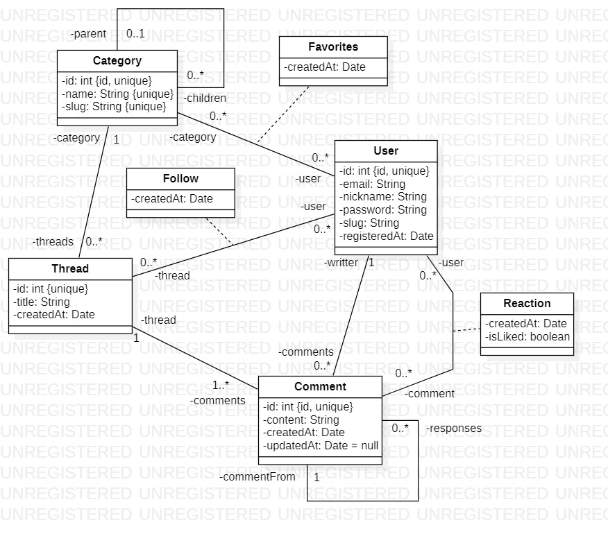

## Exos - 120/12/2023 - entrainement à l'exam

### 1. Exercice API

En utilisant l'API Harry Potter : https://hp-api.onrender.com/

Vous devez :
- Récupérer les personnages des film, et les créer dans des objets.
- L'objet a le nom "HPCharacter" et a les attributs suivants :
  - String id
  - String name
  - String species
  - String house
  - String birthAt (dateOfBirth dans l'API)
  - boolean isAlive
  - String image
  - String wandCore (attribut core de l'objet wand dans l'API)
- Créer les objets en interrogeant l'API et les stocker dans une List<HPCharacter>
- Vérifier vos données

### 2. JDBC

Faites vous la base de données adéquat pour stocker cet objet, ne vous embêtez pas, utiliser celle qui est déjà reliée.

Et bien sûr, faites le repository qui lui est lié, et tester le.

(Servez vous de l'AbstractRepository)

### 3. Faire des classes 

Modélisez les classes du diagramme UML suivant :

### 4. DAO

Faire le GameRepository MAIS : seulement les colonnes de bases renseignées dans la table, ne faites pas les jointures.

Vous aurez besoin seulement de la méthode "GetObject" pour la suite.

Modifier "AbstractRepository", pour lui ajouter une méthode :

- Nom : "executeQuery"
- Visibilité : public
- Paramètre : "String query"
- Retour : "List<T>"
- Rôle :
  - Prendre en paramètre une query formatté en SQL (genre un "SELECT * FROM game") et l'exécuter pour renvoyer le résultat de celle-ci

Grâce à elle on peut effectuer des requêtes spécifiques nous-même, comme un "SELECT * FROM game JOIN user_own_game ON user_own_game.game_id = game.id", vous voyez l'idée ?

Faire cette méthode.

### 5. DAO Suite

Testez votre GameRepository avec la nouvelle méthode executeQuery (ou pas...), pour faire les requêtes suivantes :
- Récupérer les 5 jeux s'étant le plus vendu (Les jeux les plus présents dans la table user_own_game)
- Récupérer les 5 jeux les plus chers
- Récupérer les 5 jeux les mieux notés

